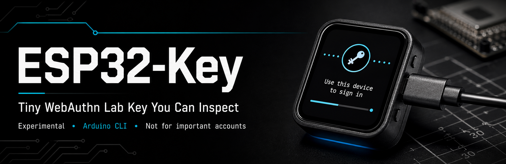

# ESP32-S3 Display FIDO Lab Key

<p align="center">
  
</p>

Experimental Arduino CLI firmware that turns Waveshare ESP32-S3 display boards into USB FIDO/WebAuthn lab authenticators.

This is a learning and testing project. It has completed Chrome/WebAuthn.io registration and sign-in in local testing for both non-discoverable and discoverable/resident credentials, but it is not a certified security key and must not be used to protect important accounts.

## Safety Boundary

Use this only with owned disposable accounts, local test apps, or public demo relying parties such as WebAuthn.io.

This board stores or derives credential secrets from ESP32-S3 flash/NVS state. In the current lab profile, a person with physical possession of the board and the right tooling may be able to extract or clone credential material. Reset is useful cleanup, not forensic erasure.

This project does not claim:

- FIDO certification.
- Production hardening.
- Secure-element-backed key storage.
- Production attestation.
- Resistance to physical extraction.
- Suitability for personal, business, financial, cloud, developer, password-manager, cryptocurrency, or government accounts.

Read [SECURITY.md](SECURITY.md) before using the device with any account.

## What It Does

- Enumerates as a USB FIDO HID device named for the selected board profile.
- Handles CTAP2 registration, sign-in, discoverable/resident credentials, credential management, host-entered lab PIN flows, and guarded reset.
- Supports stateless non-resident credentials with 33-byte wrapped credential IDs.
- Keeps browser testing CTAP2-first while retaining direct legacy U2F probe coverage.
- Uses BOOT/GPIO0 as the physical user-presence button for registration, signing, and reset.
- Shows host activity, prompts, errors, and reset/admin state on the board display.
- Optionally writes redacted TF-card lab logs and proof notes without USB mass storage or credential export.
- Includes repeatable host probes for compile, enumeration, CTAP2, U2F, PIN, browser-compat behavior, and cleanup reset.

## Hardware

Supported board profiles:

- `fido-lab`: [Waveshare `ESP32-S3-Touch-AMOLED-1.8`](https://amzn.to/3SnJePm), 368 x 448 SH8601 AMOLED, ESP32-S3R8, 16 MB flash, 8 MB PSRAM, native USB-C, BOOT on GPIO0, optional FAT32 TF card for redacted lab diagnostics.
- `fido-lab-147`: [Waveshare `ESP32-S3-Touch-LCD-1.47`](https://amzn.to/4uQZ5Dl), 172 x 320 ST7789-compatible/JD9853 LCD, ESP32-S3R8, 16 MB flash, 8 MB PSRAM, native USB-C, BOOT on GPIO0.

Use a USB-C data cable. Charge-only cables can power the board without exposing serial or FIDO HID.

## Quick Start

Install probe dependencies:

```sh
python3 -m pip install hidapi cbor2 cryptography
```

Compile the lab profile:

```sh
arduino-cli compile --profile fido-lab .
```

Compile the 1.47 inch Touch-LCD profile:

```sh
arduino-cli compile --profile fido-lab-147 .
```

List attached boards:

```sh
arduino-cli board list
```

Upload to the detected ESP32-S3 serial port:

```sh
arduino-cli upload --profile fido-lab -p /dev/cu.usbmodemXXXX .
```

For the 1.47 inch Touch-LCD board:

```sh
arduino-cli upload --profile fido-lab-147 -p /dev/cu.usbmodemXXXX .
```

After flashing, run the repeatable baseline:

```sh
tools/run_probe_baseline.sh
```

The baseline compiles `fido-lab`, lists FIDO HID devices, runs the host probe ladder, creates disposable lab credentials, sets the lab PIN during the PIN smoke test, and ends with a guarded CTAP2 reset. Press BOOT whenever the device display asks for user presence or reset confirmation. For the 1.47 board, compile and upload `fido-lab-147` first, then run the individual probe commands in `docs/bringup/arduino-cli-mvp.md`.

Browser testing is separate. Use a real browser/WebAuthn.io flow when you need browser proof.

## Browser Demo

Use a test relying party only. WebAuthn.io has worked with:

- User verification: discouraged
- Attachment: cross-platform
- Attestation: none
- Public key algorithm: ES256
- Discoverable credential: discouraged for non-resident testing
- Discoverable credential: required for resident credential testing
- USB security key selected when the browser prompts

Expected flow:

1. Start registration or sign-in in the browser.
2. Select the USB security key.
3. Confirm the device display shows the expected action.
4. Press BOOT once for user presence.
5. Confirm the browser completes the operation.

For WebAuthn.me iOS debugging on the 1.47 board, start with the Debugger page and keep the ceremony plain: cross-platform attachment, user verification discouraged, attestation none, resident key discouraged, require resident key false, extensions off, and a fresh disposable username. If the iOS sheet fails before the display leaves `USB HID ready`, treat it as a browser/USB discovery problem rather than a CTAP credential failure. The `fido-lab-147` runtime sets the TinyUSB VID/PID to the same Waveshare identity used by the working AMOLED profile while preserving the FIDO-only HID report path.

## Proof Levels

Keep these separate when reporting results:

- Compile-ready: Arduino CLI build succeeded.
- Uploaded: esptool wrote and verified flash.
- Enumerated: the host sees the FIDO HID device.
- Probe-proven: `tools/ctaphid_probe.py` or `tools/run_probe_baseline.sh` passed.
- Browser-proven: a real browser registration/sign-in succeeded.

Compile output alone is not browser or hardware proof.

## Project Layout

- `esp32-key.ino`: Arduino sketch entrypoint.
- `sketch.yaml`: board profile, FQBN, ESP32 core, and library source of truth.
- `src/`: USB HID, CTAPHID, CTAP2/U2F, CBOR, crypto, NVS storage, BOOT presence, display UX, and lab recorder modules.
- `tools/ctaphid_probe.py`: focused host probe tool.
- `tools/run_probe_baseline.sh`: repeatable compile/list/probe/reset baseline.
- `docs/bringup/arduino-cli-mvp.md`: full bring-up and probe reference.
- `docs/roadmap/solo-like-lab-plus.md`: feature roadmap and proof notes.
- `docs/specs/esp32-s3-fido2-webauthn-authenticator-spec.md`: design-level notes and hardening boundaries.

## Development Rules

- Keep this Arduino CLI-only.
- Do not add PlatformIO, ESP-IDF project scaffolding, CMake conversion, keyboard HID, mouse HID, mass storage, covert host-control behavior, credential export, phishing flows, or impersonation flows.
- Use `fido-lab` or `fido-lab-147` for realistic browser/WebAuthn testing on the matching board.
- Use `debug-cdc` or `debug-cdc-147` only for explicit bring-up work.
- Keep docs blunt about the lab-only risk boundary.

This is a bench key for learning how FIDO/WebAuthn works on tiny hardware. Treat it like a transparent prototype, not a production authenticator.
